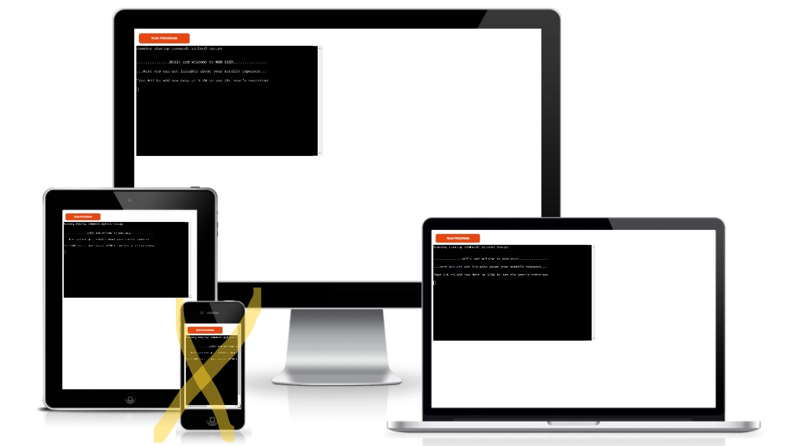
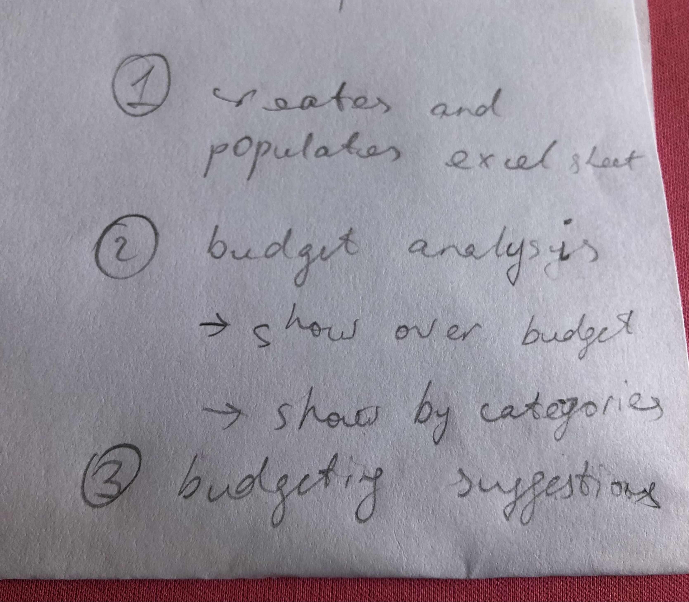
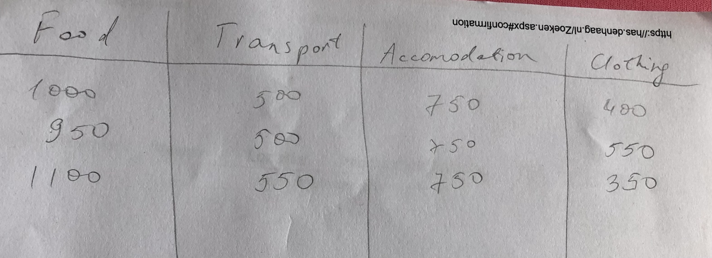
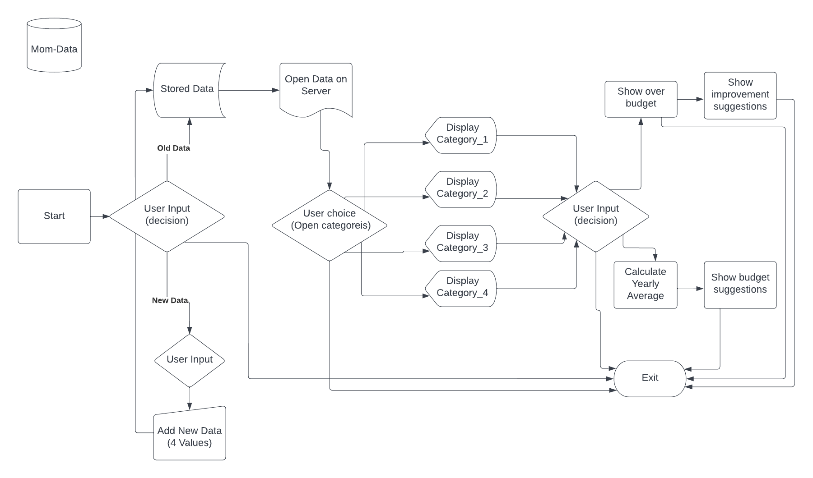

# Mom Data
## Budget Analysing Tool for the Whole Family

The application creates and populates a database from user input
It's possible to sort data by headings (and filter by budget)
Budgeting suggestions are given based on headings chosen

# [Live View](https://mom-data.herokuapp.com/)

Initial scribbles

## Potential features:
- Add monthly expenses for a specific month (choose from the menu), if existing, update data for that month
- Each user should be able to create their own worksheet, with some pre-populated data to edit
- additional to standard expenses, custom categories can be added. Standard categories can be edited or removed
- Downloading and saving the current data possible

## Structure Flowchart

## Creating the Heroku app

When you create the app, you will need to add two buildpacks from the _Settings_ tab. The ordering is as follows:

1. `heroku/python`
2. `heroku/nodejs`

You must then create a _Config Var_ called `PORT`. Set this to `8000`

If you have credentials, such as in the Love Sandwiches project, you must create another _Config Var_ called `CREDS` and paste the JSON into the value field.

Connect your GitHub repository and deploy as normal.

## Sources
How to use Pandas: https://datatofish.com/read_excel/

How to Use Google Sheets With Python (2022): https://www.youtube.com/watch?v=bu5wXjz2KvU