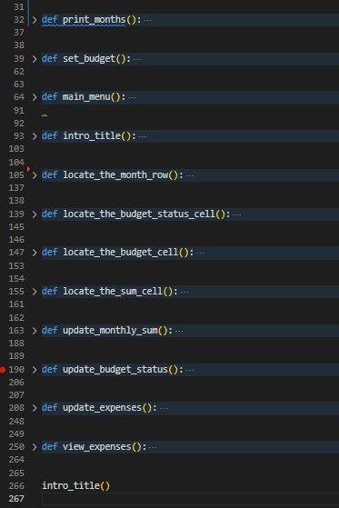

# Mom Data
## Budget Analysing Tool for the Whole Family
Mom Data is a user-freindly application for storing, retrieveing and calculating major life expense categories: Food, Transport, Accomodation and Clothing.
The application populates a database from user input, calculates the sum of the monthly expenses and compares it to the given budget.

This project is an application developed in Python, that runs in a command-line and is visually presented through the Heroku platform.

:point_down: Click the link below for the live view: 

# [Live View](https://mom-data.herokuapp.com/)

## Contents:
- [Features](#features)
    - [Future Features](#future-features)
- [Development Stages](#development-stages)
    - [Structure](#structure-flowchart)
    - [Planning](#initial-planning)
- [Testing](#testing)
    - [Validators](#validators)
    - [Manual Testing](#manual-testing)
    - [Debugging](#debugging)
- [Deployment](#deployment)
- [Sources & Credits](#sources-and-credits)
- [Acknowledgemts](#acknowledgements)

## Features
- Welcoming introduction
- Setting the budget

- Main menu
    - VIEW
    - ADD
    - BUDGET
    - EXIT

- View the year's overview

- Add monthly expenses for a specific month (choose from the menu), if existing, update data for that month

- Cat is not a number! ... User input validation

### Future Features:

- Each user should be able to create their own worksheet, with some pre-populated data to edit
- additional to standard expenses, custom categories can be added. Standard categories can be edited or removed
- Downloading and saving the current data possible

## Development Stages

### Structure

### Initial planning

## Testing

### Validators

### Manual testing

### Debugging

Traceback error in the terminal

## Deployment

### Creating the Heroku app

Connected to GitHub repository and deployed.

## Sources and Credits

How to use Pandas: https://datatofish.com/read_excel/

How to Use Google Sheets With Python (2022): https://www.youtube.com/watch?v=bu5wXjz2KvU

Gspread for the project: https://github.com/annagabain/love-sandwiches-walkthrough from Code Institute

Some inspiration from Build A Simple Expense Tracker Using Python: https://www.youtube.com/watch?v=AnKc74fWYCg

How to Validate User Inputs in Python: https://www.youtube.com/watch?v=LUWyA3m_-r0

Global variables: https://www.w3schools.com/python/python_variables_global.asp

## Acknowledgemts

Richard Wells - course mentor for friendly guidance, help with refactoring some code and feedback on the project

Jakob Lövhall - providing warm support, inculding babysitting most evenings to allow more time for the project