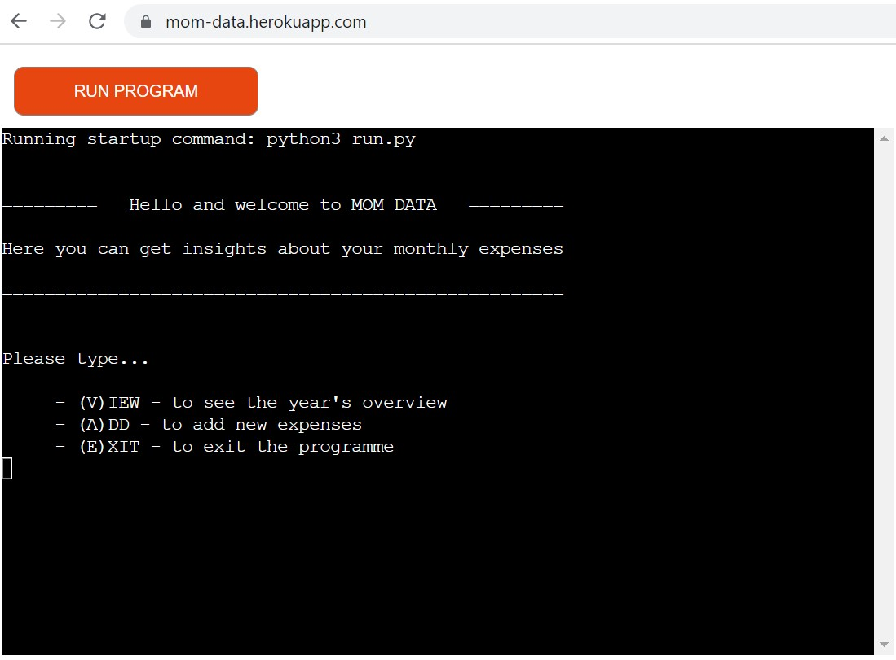

# Mom Data
## Budget Analysis Tool for the Whole Family

Mom Data is a user-friendly application for storing, retrieving and calculating major life expense categories: Food, Transport, Accommodation and Clothing. Mom Data is for family budget keepers. It aims to provide a clear overview of their monthly expenses throughout the year. 

The application populates a database from user input, calculates the sum of the monthly expenses and compares it to the given budget. It gives clear user guidance and feedback about the inputs, checks the data to be valid and that the programme flows uninterrupted until the user chooses to end it.

This is the third Portfolio Project in frames of the Code Institute Full Stack Web Developer Course Assessment. It is for educational purposes and developed in Python programming language, which runs in a command-line terminal that is visually presented through the Heroku platform. Further tools and languages will be implemented for the consequent projects.

:point_down: Click the link below for the live view: 

# [Live View](https://mom-data.herokuapp.com/)

## Contents:
- [UX](#ux)
- [Features](#features)
    - [Welcoming Intro](#welcoming-introduction)
    - [Main Menu](#main-menu)
    - [Future Features](#future-features)
- [Development Stages](#development-stages)
    - [Planning](#initial-planning)
    - [Structure](#structure-flowchart)
    - [Using Libraries](#using-libraries)
- [Testing](#testing)
    - [Validators](#validators)
    - [Manual Testing](#manual-testing)
    - [Debugging](#debugging)
- [Deployment](#deployment)
    - [Heroku](#creating-the-heroku-app)
- [Sources & Credits](#sources-and-credits)
- [Acknowledgments](#acknowledgments)

## UX
(User Experience)

The application is intended, foremost for mothers that keep the family budget. However, it is suitable for wide audiences, practically everyone who is willing to document and keep track of their periodic life expenses. Mom Data is intuitive to use and guides the user through the process with input validations and recurring main menu. The project is kept simple to make sure the users can dedicate very little time and achieve desired results. A very important feature, especially for working mothers with children.

NOTE: !! *MOM DATA app runs on PC-s or Laptops and is not suitable for mobile _phones and _is _not__ recommended on_ tablets.*

## Features

### Welcoming introduction

Mom Data app starts with greeting the user and a short description of its purpose: Here you can get insights about your monthly expenses.

### Main menu

The recurring main menu encourages the user to choose between the three menu options, by typing merely the initials of the words:

VIEW

ADD

EXIT

- Upon typing the letter V (or v, which is accepted by the programme as well), the user immediately sees the current table demonstrating the year's expenses overview. The data is already saved during the previous inputs.

To continue with the application, the main menu again offers to choose between the categories view, add and exit.

- To add new expenses, the user simply enters A (or a). The menu asks to choose an expense month by typing the corresponding numbers. Here it is important to make sure the input leads to the correct location in the database. So if the user enters a wrong number, that does not represent any month, the app will encourage trying over and over again until a specific month is chosen.

*Cat is not a number! ... User input validation*

Upon choosing the desired month, Mom Data would like to know the budget to compare the expenses with. The user input is taken to update the expenses for that month.

After a successful update, the user can choose to view the current expense data, including the recent input, add new expenses, or simply exit the programme.

- Exiting the app is easy and requires typing the initial E(or e). A friendly and concise **'Goodbye'** message signals the current budgeting session has been closed.

### Future Features:

- Currently, Mom Data works with an existing, prepopulated worksheet, stored on Google API. In a future implementation, each user should be able to create an individual worksheet.
- Additional to standard expenses, custom categories will be added. A possibility will be introduced to edit or remove the Standard categories.
- Downloading and saving the current data will be made possible. At the moment a sharing option can be added only, however, due to complications with a request of opening an own google account, it was decided to leave this option open.

## Development Stages

### Initial planning

Initially, the main expense categories (Food, Transport, Accommodation, Clothing) were taken from the author's previous project, JavaScript budget calculator https://github.com/annagabain/Mom-Calculator . So was the target user and general functionality inherited to demonstrate a connection between the projects. However, the implementations in Python differ from those in JavaScript. 

*The initial flowchart focused on expense categories rather than budget months* 

Later on, during the project development, it became evident the usage of budget comparison was connected to a specific month, and the app flow changed accordingly.

### Structure

The Python code is written in Gitpod integrated VSCode editor, run.py file. Right after initializing necessary dependencies, global variables and libraries, the 12 project functions lign-up one after the other to provide Mom Data with structured code.

Some functions contain the main content of the app (e.g. main_menu, update_expenses), whereas the others supply them with 'tools' to work with (e.g. locate_the_budget_cell, print_months, etc.)

*The 12 functions of the project*

### Using Libraries

Document the rationale as to why a particular library/libraries are necessary for the implementation of the project.
Pandas

Pandas is a Python library.

Pandas is used to analyze data.

Gspread

## Testing

No automated testing has been used on this project, I have opted to do all testing manually and through numerous user experiences.

Method:
Test:
Result:

### Validators

PEP8

### Manual testing

### Debugging

Bug:
Cause:
Solution:

Traceback error in the terminal

Months menu bug

F-string bugs

Budget bug

## Deployment

The project is deployed to GitHub via Gitpod Terminal with integrate VScode editor. Then it is connected to the Heroku app to be reached via a web browser for user convenience. To enable this, a special Code Institute template was cloned and used https://github.com/Code-Institute-Org/python-essentials-template .

The code is placed in run.py file and dependencies are placed in the requirements.txt file. The steps of Heroku deployment were taken from the Code Institute  Love Sandwiches walkthrough project, step by step as required.

### Creating the Heroku app

The project was deployed to Heroku as follows:

- Create an account and log into heroku.com
- Click 'New' from the dashboard, and from the drop-down menu select "Create new app"
- Make a unique app name: mom-data
Choose a relevant geographical region, Europe
- Click "Create app"
- In the settings menu, go to "Config Vars" section
- Click "Reveal Config Vars", where type "key" for port, "value" for 8000 and click "add"
- Add "Python" first and then "node.js" buildpacks
- In "Deploy" tab, select Github as the deployment method
- Connect to GitHub
- Find the project repository and click "connect" next to it
- "Enable Automatic Deploys" for automatic deployment with every new change

## Sources and Credits

How to use Pandas: https://datatofish.com/read_excel/

How to Use Google Sheets With Python (2022): https://www.youtube.com/watch?v=bu5wXjz2KvU

Gspread for the project: https://github.com/annagabain/love-sandwiches-walkthrough from Code Institute

Some inspiration from Build A Simple Expense Tracker Using Python: https://www.youtube.com/watch?v=AnKc74fWYCg

How to Validate User Inputs in Python: https://www.youtube.com/watch?v=LUWyA3m_-r0

Global variables: https://www.w3schools.com/python/python_variables_global.asp

Flowchart: https://lucid.app/

## Acknowledgments

Richard Wells - course mentor for friendly guidance, help with refactoring some code and feedback on the project

Jakob Lövhall - providing warm support, including babysitting most evenings to allow more time for the project